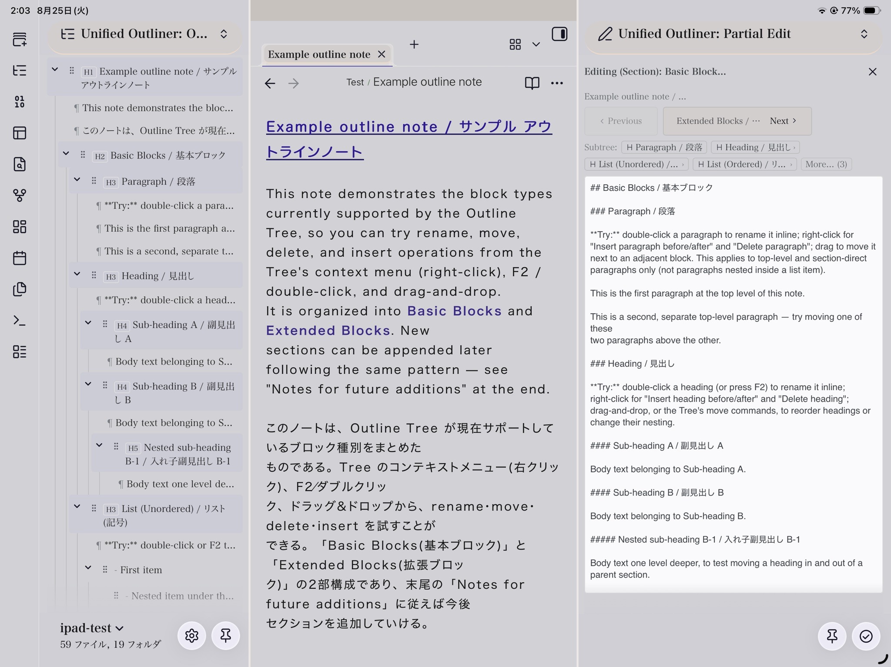

# Unified Outliner

[English](README.md)

> Obsidianのノート内にある見出しセクションとリストの部分木を、周囲の構造を見失わずに再編成するためのプラグインです。

Unified Outliner は、単一のMarkdownノート内で構造を編集するための [Obsidian](https://obsidian.md) プラグインです。見出しセクションとリストの部分木を、本文エディタ、専用の Outline Tree View、ブロックに焦点を当てて編集するための Partial Edit Pane から移動・レベル変更・閲覧・編集できます。

**現行バージョン:** 最新版と変更履歴は[Releases](https://github.com/kazdonkai/unified-outliner/releases)を参照。

**必要なObsidianのバージョン:** 1.8.7以上

**対象範囲:** 一度に扱うのは1つのノートです。ノート間で内容を移動することはありません。

## このプラグインの独自性

Obsidian標準のアウトラインは見出し構造を移動するのに適しています。また、リスト中心のアウトライナー系プラグインは個々のリスト項目を扱いやすくします。Unified Outliner は、その両方が同じノート内で必要になる場面、すなわち意味のまとまりを持つ見出しセクションと入れ子のリスト構造を、安全かつ可視的な単位として再編成することに焦点を置きます。

| 機能 | Obsidian標準アウトライン | リスト中心のアウトライナー系プラグイン | Unified Outliner |
| --- | --- | --- | --- |
| 見出し構造の移動 | 可能 | 実装による | ツリー選択と同期して可能 |
| 本文・子セクションを含む見出しセクション全体の移動 | 不可 | 主目的ではない | 可能 |
| 入れ子のリスト部分木の移動・親子関係変更 | 不可 | 多くの場合可能 | 可能 |
| 見出しとリスト項目を同じ構造ツリーに表示 | 不可 | 実装による | リスト表示を有効にすれば可能 |
| 選択したセクション／リスト部分木だけを別ペインで集中編集 | 不可 | 実装による | 明示的な Apply と競合保護付きで可能 |
| ファイルごとのツリー折りたたみ状態の保存 | 不可 | 実装による | 複数の Outline Tree View 間で同期して保存 |

Unified Outliner は、全文検索、タスク管理、Dataview型の集計、AIによる文章作成を置き換えるものではありません。Markdownノートの信頼できる構造編集に専念します。

## インストール

### Community Plugins からインストールする（推奨）

1. Obsidianで **設定 → コミュニティプラグイン → 閲覧** を開きます。必要であれば制限モードを解除します。
2. **Unified Outliner** を検索し、選択して **インストール** します。
3. **設定 → コミュニティプラグイン** で **Unified Outliner** を有効にします。

ブラウザからは、[Unified Outliner の Community Plugins ページ](https://community.obsidian.md/plugins/unified-outliner)も開けます。

### ベータ版を BRAT で導入する

ベータ版や最近の開発版を試す場合は、[BRAT](https://github.com/TfTHacker/obsidian42-brat) を利用します。

1. **設定 → コミュニティプラグイン → 閲覧** から **Obsidian 42 - BRAT** をインストールして有効にします。
2. コマンドパレットで **BRAT: Add a beta plugin for testing** を実行します。
3. `https://github.com/kazdonkai/unified-outliner` を入力し、導入を確定します。
4. BRATの処理後、**設定 → コミュニティプラグイン** で **Unified Outliner** を有効にします。

BRATはリポジトリの更新を確認します。通常のカタログ公開前の変更も試したい場合に利用してください。

### GitHub Releases から直接ダウンロードする

特定バージョンを手動で導入する場合は、[GitHub Releases](https://github.com/kazdonkai/unified-outliner/releases) から `main.js`、`manifest.json`、`styles.css` の3ファイルをダウンロードします。

1. Vault内に次のフォルダがなければ作成します。

   ```text
   <あなたのVault>/.obsidian/plugins/unified-outliner/
   ```

2. ダウンロードした3ファイルすべてを、そのフォルダにコピーします。
3. Obsidianで **設定 → コミュニティプラグイン** を開き、**Unified Outliner** を有効にします。
4. すぐに表示されない場合は、Obsidianを再読み込みしてください。

### 更新する

Community Plugins と BRAT は、それぞれ更新を管理します。直接ダウンロードした場合は、`<あなたのVault>/.obsidian/plugins/unified-outliner/` にある同じ3ファイルを置き換え、Obsidianを再読み込みします。通常のVaultバックアップは、更新時にも保持してください。

## アウトラインノートの例



このスクリーンショットは、iPad上で実際に使用している Unified Outliner を示しています。左に Outline Tree View、中央に開いた `Example outline note.md`、右に Basic Blocks セクションを編集している Partial Edit Pane が並んでいます。同様の構造は、このリポジトリの [`examples/Example outline note.md`](examples/Example%20outline%20note.md) で実際に試すことができます。お手元のVaultで開き、Outline Tree View の rename・move・delete・insert 操作を、段落・見出し・リスト・callout・blockquote にわたって試してみてください。

1. 見出しまたはリストを含むMarkdownノートを開きます。
2. コマンドパレットから **Open outline tree view** を実行するか、リボンのツリーアイコンを選びます。
3. **Outline Tree View** は、設定の **アウトラインツリーの既定のサイドバー位置** で選んだサイドバーに開きます（既定は右サイドバー。左サイドバーも選べます — 下記の「設定」を参照）。ノードをクリックすると本文の該当箇所へカーソルが移動し、本文のカーソル移動は対応するツリーノードに反映されます。
4. ノードを右クリックすると、移動、インデント、アウトデント、Partial Edit Paneでの編集を選べます。

Outline Tree View が右サイドバーにある状態で Partial Edit Pane を開くと、そのサイドバーが分割されて両方が同時に表示されます。ツリーを左サイドバーに置くと、Partial Edit Pane は右サイドバー単独で開くようになり、上のスクリーンショットのような3ペイン構成（ツリー・ノート・編集ペイン）になります。

リスト項目も見出しとともに表示したい場合は、プラグイン設定で **Show list items in Outline Tree View** を有効にします。

## 視覚ガイド

### Outline Tree View で構造を操作する


Outline Tree View には、見出しと、設定で有効にした場合のリスト項目が、元ノートの横に表示されます。ノードを選ぶと対応する本文位置へ移動し、本文の現在位置もツリーに反映されます。

<p align="center"></p>

選択したノードを右クリックすると、構造操作を選べます。同じメニューから、block単位の移動、インデント、見出し行だけの操作、集中編集を実行できます。

### 選択した部分木に集中する


Partial Edit Pane では、選択した見出しセクションまたはリスト部分木を表示したまま、周囲のアウトラインも参照できます。


Apply は、ペインを開いた時点の元の対象範囲が変更されていないことを確認してから反映します。並行して本文が変更された場合の意図しない上書きを防ぎます。

祖先のパンくずナビゲーションと Subtree Navigator を使うと、ペインを閉じずに親ブロックへ戻ったり子ブロックへ入ったりできます。ペインはノードのコンテキストメニューから別ウィンドウにポップアウトすることもでき、未保存の変更がある状態で離れようとすると確認を求めます。

### 短い操作動画

| 操作 | 動画 |
| --- | --- |
| Outline Tree View を開く | [7秒のMP4を再生](docs/media/outline-tree-open.mp4) |
| ツリーノードを折りたたむ／展開する | [20秒のMP4を再生](docs/media/outline-collapse-expand.mp4) |
| ツリー内の選択項目を追従する | [21秒のMP4を再生](docs/media/outline-focus.mp4) |
| リスト部分木を移動する | [14秒のMP4を再生](docs/media/outline-list-move.mp4) |
| Partial Edit Pane で選択部分木を編集する | [49秒のMP4を再生](docs/media/partial-edit.mp4) |

## 使い方

### 構造を移動・レベル変更する

見出しまたはリスト項目にカーソルを置き、コマンドパレットから実行します。よく使う操作には **設定 → ホットキー** からショートカットを割り当てられます。

| コマンド | 動作 |
| --- | --- |
| **Move block up / down** | カーソル位置の最小安全ブロック（見出しセクション、リスト部分木、通常の段落、またはカーソルが内部にあるcallout・blockquote・fenced code block・table全体）を、直前または直後の兄弟要素へ移動します。 |
| **Move section up / down** | カーソルがセクション内のどこにあっても、見出し・本文・子セクションを含む囲むセクション全体を移動します。 |
| **Indent block** | リスト部分木の親子関係を変更します。見出しセクションでは、構造上安全な場合に限り見出しレベルを1段下げます。 |
| **Outdent block** | リスト部分木を上位へ移動します。見出しセクションでは、構造上安全な場合に限り見出しレベルを1段上げます。 |
| **Delete block** | 現在の見出しセクションまたはリスト部分木を削除します。 |
| **Insert sibling after current block** | 現在の見出しセクションまたはリスト項目の後に、新しい空の要素を挿入します。 |
| **Insert child list item** | 現在のリスト項目の子として、新しい空のリスト項目を挿入します。 |
| **Move extended block up / down** | カーソルが内部にある場合に、**List + Callout** または **List + Quote** としてまとめられた拡張ブロック（設定 → 拡張ブロック を参照）を1つの単位として移動します。 |

同じ操作は Outline Tree View のノードを右クリックしても実行できます。実行できない操作はノートを変更しません。理由を表示したい場合は、プラグイン設定で **Show no-op notices** を有効にしてください。Move block / Move section が実際に移動した対象は、ツリー内で一瞬フラッシュ表示され、設定を有効にすると移動内容を示す通知も表示されます。

### Outline Tree View を使う

ツリーは（どちらのサイドバーにあっても）単なるナビゲーションではなく構造編集のための作業ビューです。

- **見出しセクションをドラッグ＆ドロップ**して、セクション部分木を並べ替えられます。
- リスト表示を有効にすると、**リスト項目もドラッグ＆ドロップ**して、リスト部分木の並べ替えや親子関係変更ができます。
- ノードを**折りたたむ／展開する**ことで、ツリー独自の表示状態を制御できます。この状態はファイルごとに保存され、開いている Outline Tree View 間で同期します。
- 右クリックメニューから**文脈依存の操作**を使えます。折りたたまれたセクションは部分木として扱われ、展開されたセクションではノード単位の操作を選べます。
- **見出し・リスト項目・段落をその場でリネーム**できます。行をダブルクリックする（または行を選択してF2キーを押す、右クリックメニューから **Rename** を選ぶ）と、ツリー内でテキストを直接編集できます。Enterで確定、Escapeでノートを変更せずにキャンセルします。
- **モバイルでは**、タップで行を選択し、選択済みの行を再度タップするとリネームを開始、長押しでコンテキストメニューを開きます。
- セクション行とリスト行は、背景色や左端のストライプによって視覚的に区別できます。表示スタイルはプラグイン設定と、後述の Style Settings でさらに調整できます。

### 段落を編集する

プラグイン設定で **本文段落も Outline Tree に表示する** を有効にすると、本文の通常の段落が ¶ マーク付きの読み取り専用ナビゲーションノードとして、見出しやリスト項目と並んで表示されます — 対象はトップレベルまたはセクション直下の段落のみで、リスト項目の中に入れ子になった段落は対象外です。表示されると、段落行も他の行と同様にその場でリネームでき、コンテキストメニューには **Move up/down**、**Move to top/bottom**、**Move before/after sibling…**、**Insert paragraph before/after**、**Delete paragraph**（確認あり）、および Partial Edit Pane で開く **Edit paragraph…** が追加されます。本文エディタ側でも、**Move block up/down** はカーソル位置の段落を移動可能な単位として扱い、**Edit paragraph at cursor** コマンドはその段落を直接 Partial Edit Pane で開きます。

### callout・blockquote・拡張ブロックを編集する

下記の拡張ブロックにまとめられていない単体の callout・blockquote は、ツリー上でそれぞれ独立したノードとして表示され、コンテキストメニューには **Move up/down** と、セクションやリストサブツリーと同じ集中編集が行える **Open in Partial Edit**（ポップアウトも可能）が用意されています。fenced code block（Mermaidを含む）と table は、現時点ではツリー上で読み取り専用のままです — 本文エディタ内でカーソルがその内部にある状態であれば、**Move block** を使ってブロック全体を移動することは引き続き可能です。

**List + Callout** と **List + Quote** は、Outline Tree の2つのグループ化規則です（設定 → 拡張ブロック を参照）。空行を挟まず1行で完結する list item の直後に callout または blockquote が続く場合、その2つを1つの折りたたみ可能な単位としてツリー上にまとめます。これらの規則は構造的なものであり、画像の埋め込み、OCRの内容、特定の callout type を必要としません。**Move extended block up/down**（コマンドパレットまたはツリーのコンテキストメニュー）はこのグループ全体を一緒に移動し、**Delete extended block** は単位としてまとめて削除します — グループとしてまとめて編集することはまだできないため、リスト項目と callout/blockquote はそれぞれ本文エディタ側で個別に編集してください。規則を無効にしても Markdown 本文は変更されません。対象の list item、callout、blockquote は、それぞれ通常の Outline Tree 表示規則に従って個別に表示されます。

例えば、次の Markdown:

```markdown
- 史料画像への注記
> [!note] 転記上の注意
> 表記ゆれを原文どおり保持する。
```

は、ツリー上で次のように表示されます:

```text
◉ List + Callout
  - 史料画像への注記
  ▣ 転記上の注意
```

また、次の Markdown:

```markdown
- 史料本文の引用
> 村境は古来よりこの地点にある。
```

は、ツリー上で次のように表示されます:

```text
❖ List + Quote
  - 史料本文の引用
  村境は古来よりこの地点にある。
```

callout member には、単体の callout と同じ **▣** prefix が付きますが、blockquote member には付きません。

### 選択したブロックに焦点を当てて編集する

コマンドパレットの **Open partial edit pane for current section** を実行するか、Outline Tree Viewの右クリックメニューから対応する項目を選びます。段落の場合は、**Edit paragraph at cursor**（またはOutline Treeのコンテキストメニューの **Edit paragraph…**）を使うと直接ここに開けます。

**Partial Edit Pane** には、選択した見出しセクションまたはリスト部分木だけが専用エディタとして開きます。編集後に **Apply** を選ぶと、元のノートへ反映されます。ペインを開いた後に元ノートの対象領域が変更された場合は、競合保護のため反映を停止します。この場合は対象を読み込み直し、変更内容を確認してから編集してください。

### 見出し行だけを操作する

**Move heading label up/down** と **Indent/Outdent heading level** は、現在の見出し行だけを変更します。その見出しの本文や子セクションは移動しません。通常の再編成には block 系コマンドを使い、意図的に見出し行だけを変更したい場合に限って使用してください。

## 設定

**設定 → コミュニティプラグイン → Unified Outliner** から、**General** タブでは次のように分類されて設定できます。

- **表示言語**: 自動（Obsidian本体の言語設定に従う）、日本語、または English。プラグイン自身のUI表示にのみ影響します。
- **アウトラインツリーの既定のサイドバー位置**: 右（既定）または左。新規に開く Outline Tree View の位置のみに影響し、すでに開いている（手動で移動したものを含む）ツリーは移動しません。ツリーを左サイドバーに置くと右サイドバーが空くため、上のスクリーンショットのような3ペイン構成にできます。
- **本文段落も Outline Tree に表示する**: 本文の通常の段落を ¶ マーク付きのナビゲーションノードとして表示します。トップレベルおよびセクション直下の段落は、ツリーから編集・挿入・削除・移動も行えます（上記参照）。既定ではオフです。
- **Show list items in Outline Tree View**: リスト項目をツリーに表示します。
- **Section background style in Outline Tree**: セクション行をリスト行と見分けやすくする表示（背景／左端ストライプ／オフ）を選びます。
- **List row highlight style in Outline Tree**: ホバー時のみ（既定）、常時薄い背景、オフから選びます。
- **Heading prefix in Outline Tree**: 既定はオフ。「H1」〜「H6」、またはATX記号そのもの（「#」〜「######」）を選べます。見た目のみの設定で、見出しテキスト自体は変更しません。
- **アウトラインツリーのリストmarker**: 各リスト項目の前に、Markdownのリストマーカー（`-`、`*`、`+`、`1.` など）を表示します。既定では非表示です。
- **Allow list moves across sections**: ルートレベルのリスト項目を、見出しセクションの境界を越えて移動できるようにします。
- **Preview move target in Outline Tree**: move系コマンドが実際に操作したブロックを一瞬フラッシュ表示します。
- **Show move result toast**: move系コマンド実行後に、何を移動したかを示す通知を表示します。
- **Normalize ordered list markers to `1.`**: 構造編集後に、順序付きリストの番号記号を `1.` に統一します。
- **Follow keyboard selection into body editor**: キーボードでツリーを移動すると、本文エディタも追従します。
- **Sync Outline Tree folding to editor**: ツリーでノードを折りたたむ／展開すると、本文エディタ側の該当箇所も連動して折りたたみ／展開します。
  折りたたむ対象がある行にはトグルが表示されます。見出しの直下が本文・表・コードブロックのみで、下位見出しがない場合も対象です（本文が空の見出しは対象外）。
- **Jump scroll offset (pixels)**: ツリーからジャンプした行の上に確保する余白。既定の `0` では対象行がエディタ最上部にぴったり配置されます。固定表示のツールバーやテーマのヘッダーがノート上部を覆う場合に値を大きくしてください。最大 `1000`。- **Show no-op notices**: 実行できない操作が変更を行わなかった理由を表示します。

設定は **General**（上記のとおりカテゴリごとに区切り線で分類）と **Extended blocks** の2タブに分かれています。**Extended blocks** タブは、プラグイン組み込みの **List + Callout** と **List + Quote** のグループ化規則（詳しくは上記「callout・blockquote・拡張ブロックを編集する」を参照）を個別に有効・無効化するものです。規則を無効にしてもグループ表示が止まるだけで、Markdown本体や、まとめられているリスト項目・callout/blockquote自体は変更されません。

### Style Settings で見た目をカスタマイズする

[Style Settings](https://github.com/community-archive/obsidian-style-settings) コミュニティプラグインを導入すると、上記のトグル項目だけでなく、CSSを直接編集せずに Outline Tree View の見た目を調整できます。**設定 → Style Settings → Outline Tree View – Appearance** から、ライトモード・ダークモードそれぞれ個別に次を調整できます。

- ツリーの見出しラベルの**フォントサイズ**。
- Outline Tree View パネルの**背景色**。
- **文字色**、**目立たせない文字色**（空状態メッセージなどの補助的なテキスト）、**リスト項目の文字色**。
- **ハイライトされたノードの色**（本文エディタのカーソル位置に対応する行）と、**キーボード選択の背景色**（キーボード操作で選択中の行）。
- **セクション行の背景色**と**リスト行の背景色**（上記のハイライトスタイルで使われる色）。
- **move対象プレビューのフラッシュ色**（move系コマンド実行後に一瞬表示される色）。

## 安全に使うために

構造編集はMarkdownのテキストを変更します。通常のVaultバックアップを維持し、独自記法や複雑なMarkdownを含むノートでは、反映後に結果を確認してください。

- Unified Outliner はアクティブなノート内だけで動作し、ノート間で内容を移動しません。
- frontmatterはすべての構造操作の対象外です。
- 単体の callout・blockquote は、Outline Tree View から直接move・Partial Edit Paneでの編集ができます（上記の視覚ガイドを参照）。fenced code block（Mermaidを含む）と table は、引き続き読み取り専用ノードとして表示されます。本文エディタ側でカーソルがこれら4種のいずれかの内部にある場合は、Move blockでブロック全体を移動できます。
- リスト項目と callout/blockquote をまとめた **List + Callout** または **List + Quote** の拡張ブロック（設定 → 拡張ブロック を参照）は、Outline Tree View からまとめて move・delete できますが、グループとしてまとめて編集することはまだできません。リスト項目と callout/blockquote はそれぞれ本文エディタ側で個別に編集してください。
- Partial Edit Pane は、読み込み後に元の対象領域が変更されていない場合にだけ適用されます。

## ロードマップ

ポップアウトウィンドウ、パンくずナビゲーション、Outline Tree のインライン編集（リネーム）、段落の表示・編集、左右選択可能な Outline Tree サイドバー配置、そして単体の callout・blockquote とグループ化された拡張ブロックに対するmove・編集は既に利用できます（上記参照）。fenced code block と table は、引き続きツリー上で読み取り専用です。これらを同様のmove・追加・削除に対応させることが次の段階です。

後続の方向性と、意図的に対象外とする機能は、簡潔な[ロードマップ](ROADMAP.ja.md)を参照してください。

## コントリビュート

バグ報告とプルリクエストを歓迎します。最小限の再現用Markdown、実行したコマンドまたはツリー操作、実際の結果、期待する結果を添えてください。開発環境と必須チェックは [CONTRIBUTING.md](CONTRIBUTING.md) に記載しています。

報告には、機密情報や個人情報を含めないでください。

## 開発について

本プラグインの実装の多くは、メンテナーの指示とレビューのもと、[Claude](https://www.anthropic.com/claude)（Anthropic）の支援を受けて開発されました。

## ライセンス

Unified Outliner は [MIT License](LICENSE) の下で公開しています。Copyright © 2026 Kazdon Kai。
